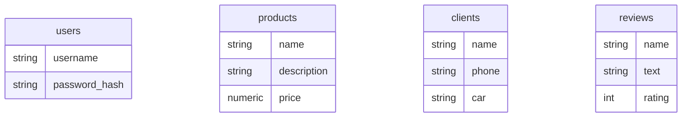

# Документация по базе данных «AvtoShop»

## 1. Обзор

Система «AvtoShop» использует реляционную систему управления базами данных **PostgreSQL**. База данных размещена на облачной платформе **Supabase** и содержит всю информацию, необходимую для работы приложения, включая данные о пользователях, услугах, клиентах и отзывах.

Бэкенд-приложение подключается к базе данных с помощью библиотеки `pg`, используя строку подключения, указанную в файле `backend/db.js`.

---

## 2. Схема базы данных (DDL)

Ниже представлен SQL-код, описывающий структуру таблиц, их поля, типы данных, ограничения и первичные ключи.

```sql
-- Таблица для хранения услуг (товаров)
CREATE TABLE products (
    id SERIAL PRIMARY KEY, -- Уникальный автоинкрементируемый идентификатор
    name VARCHAR(255) UNIQUE NOT NULL, -- Название услуги, должно быть уникальным
    description TEXT, -- Подробное описание услуги
    price NUMERIC(10, 2) NOT NULL, -- Цена с точностью до двух знаков после запятой
    created_at TIMESTAMP WITH TIME ZONE DEFAULT CURRENT_TIMESTAMP -- Дата и время создания записи
);

-- Таблица для хранения пользователей (администраторов)
CREATE TABLE users (
    id SERIAL PRIMARY KEY, -- Уникальный идентификатор
    username VARCHAR(50) UNIQUE NOT NULL, -- Логин пользователя, должен быть уникальным
    password_hash VARCHAR(255) NOT NULL, -- Хеш пароля, сгенерированный bcrypt
    created_at TIMESTAMP WITH TIME ZONE DEFAULT CURRENT_TIMESTAMP -- Дата и время регистрации
);

-- Таблица для хранения отзывов
CREATE TABLE reviews (
    id SERIAL PRIMARY KEY, -- Уникальный идентификатор
    name VARCHAR(255) NOT NULL, -- Имя автора отзыва
    text TEXT NOT NULL, -- Текст отзыва
    rating INTEGER NOT NULL CHECK (rating >= 1 AND rating <= 5), -- Рейтинг от 1 до 5 (проверка на уровне БД)
    created_at TIMESTAMPTZ DEFAULT CURRENT_TIMESTAMP -- Дата и время создания отзыва
);

-- Таблица для хранения информации о клиентах (структура восстановлена из кода)
CREATE TABLE clients (
    id SERIAL PRIMARY KEY, -- Уникальный идентификатор
    name VARCHAR(255) NOT NULL, -- ФИО клиента
    phone VARCHAR(50), -- Контактный номер телефона
    car VARCHAR(255) -- Информация об автомобиле клиента (марка, модель)
);
```

---

## 3. Описание таблиц и ограничений

### Таблица `products`
-   **Назначение**: Хранит информацию о предоставляемых услугах.
-   **Ограничения**: `UNIQUE` на поле `name` гарантирует отсутствие дубликатов услуг. `NOT NULL` на `price` обеспечивает наличие цены у каждой услуги.

### Таблица `users`
-   **Назначение**: Хранит учетные данные администраторов.
-   **Ограничения**: `UNIQUE` на `username` критически важно для безопасности, гарантируя уникальность логина для входа.

### Таблица `reviews`
-   **Назначение**: Содержит публичные отзывы о сервисе.
-   **Ограничения**: `CHECK (rating >= 1 AND rating <= 5)` на уровне БД обеспечивает целостность данных, не позволяя записать некорректный рейтинг.

### Таблица `clients`
-   **Назначение**: Используется в админ-панели для ведения клиентской базы.

---

## 4. Логические связи и ERD

В текущей схеме базы данных отсутствуют жесткие внешние ключи (`FOREIGN KEY`). Это означает, что целостность на уровне связей "один-ко-многим" не контролируется самой СУБД, а остается на уровне бизнес-логики приложения. Все таблицы являются независимыми сущностями.


_Диаграмма показывает, что таблицы на данный момент не имеют прямых связей на уровне БД._

**Потенциал для развития**: В будущем для построения более сложных отчетов можно было бы связать таблицы. Например, добавить в таблицу `clients` поле `user_id`, чтобы закрепить клиента за определенным менеджером, или в таблицу `reviews` добавить `product_id`, чтобы понять, к какой именно услуге относится отзыв.

---

## 5. Стратегия индексирования

Индексы критически важны для производительности запросов `SELECT`, особенно при росте объема данных.

### Существующие индексы:
-   PostgreSQL автоматически создает B-Tree индексы для всех полей, являющихся `PRIMARY KEY` (`id` в каждой таблице) и `UNIQUE` (`products.name`, `users.username`). Это обеспечивает мгновенный поиск по этим полям.

### Рекомендации по дополнительному индексированию:

Для ускорения операций поиска и фильтрации, реализованных в API, рекомендуется создать следующие индексы:

1.  **Поиск клиентов**: В API есть поиск по имени, телефону и машине клиента. Создание композитного индекса или отдельных индексов значительно ускорит этот поиск.
    ```sql
    -- Для ускорения поиска по имени клиента
    CREATE INDEX idx_clients_name ON clients(name);
    ```

2.  **Поиск услуг**: Аналогично для услуг.
    ```sql
    -- Для ускорения поиска по названию услуги (хотя оно уже уникально и индексировано)
    -- Дополнительный индекс может потребоваться для регистронезависимого поиска, если он будет реализован
    ```

3.  **Сортировка отзывов**: Отзывы всегда сортируются по дате. Индекс на поле `created_at` ускорит эту операцию.
    ```sql
    CREATE INDEX idx_reviews_created_at ON reviews(created_at DESC);
    ```

Создание этих индексов — это недорогая операция, которая даст ощутимый прирост производительности по мере наполнения базы данных.
